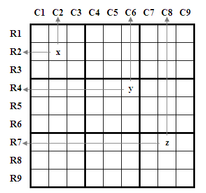
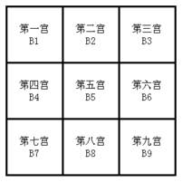

# sudoku
使用JavaScript生成一个9*9的数独盘面

#思路
 
1. 首先生成一个9*9的空盘面，并为他们添加className，如图：x的className为c2和r2，y的className为c6和r4，以此类推。b1-b9分别为9个宫的className。
2. 新建三个数组，rArr(行)、cArr(列)和bArr(宫)，每个数组中包含9个子数组，分别表示r1-r9、c1-c9、b1-b9。如图，x应当被添加到rArr[2]、cArr[2]和bArr[1]中，y应当被添加到rArr[4]、cArr[6]和bArr[5]中。
3. 生成一个1-9的随机整数n，将n放到rArr[1]、cArr[1]和bArr[1]中进行匹配，如果匹配结果为false，则将数字n push到rArr[1]、cArr[1]和bArr[1]中，然后将n写入到盘面的第一个格子中；如果匹配结果为true，则重新生成一个随机整数，再次进行匹配，直到结果为false。
4. 循环步骤3，每次成功写入数字到盘面后，执行c+1(切换到下一列)操作，当c=9时,下一次执行r+1(切换到下一行)，c重置为1 。
5. 当生成的随机数，连续50次匹配到的结果均为true时，我们认为此时已经没有正解了，也就是进入了死胡同。此时我们进行的操作是，将b-1（也就是向前移一个宫），然后在上一个宫的相同位置重新开始生成随机数，试图来跳出死胡同。
6. 很不幸，即便是使用该方法，依然有很大的几率不能跳出死胡同，大概只有10%的几率能生成一个完整的数独盘面，希望有想法的小伙伴能完善该算法。

#DEMO

[演示页面](http://output.jsbin.com/pokire)
